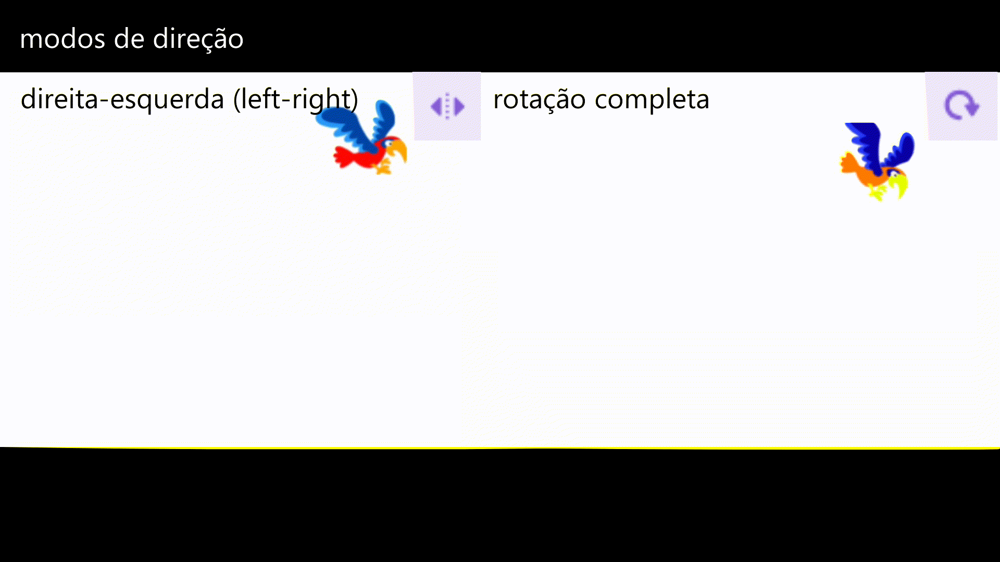
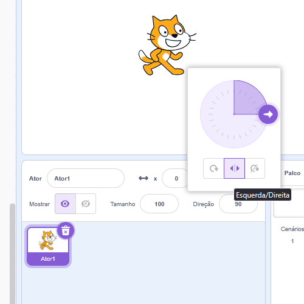

**Módulo:** [0 - Introdução](https://projects.raspberrypi.org/pt-BR/pathways/scratch-intro)

**Atividade:** [3 - Encontre o Bug](https://projects.raspberrypi.org/pt-BR/projects/find-the-bug)

**Projeto pronto:** [contém spoilers](https://scratch.mit.edu/projects/1163037922/)

---



> 💡 Sabia que o primeiro bug de computador era um inseto (bug em inglês) de verdade?
> Ele foi encontrado e registrado por [Grace Hopper](https://pt.wikipedia.org/wiki/Grace_Hopper), uma das pessoas mais influentes na história da computação.

Na atividade de hoje, vamos fazer um jogo de "esconde-esconde": o jogador vai ter que procurar com muita atenção na tela um inseto escondido.

Primeiro, clique no link ali em cima pra começar a atividade e siga os passos do material.

Essas são as dicas de cada um dos capítulos da atividade:


O material dessa aula vai te recomendar começar o projeto a partir de um projeto inicial que eles dão o link, mas isso não é necessário.

Então, crie seu novo projeto pois vamos fazer nosso próprio, do zero!

A ideia desse jogo é termos vários planos-de-fundo e alternarmos entre eles. O material vai sugerir planos de fundo específicos, mas você pode escolher o que quiser!

O material sugere que você escreva um texto por cima da imagem do cenário, então escolha o primeiro cenário pra ser a tela inicial do seu jogo.

Seu ator também não precisa ser necessariamente um inseto! Tente algum outro animal ou objeto que você goste.



Cada nível do jogo vai ser um novo cenário, e o inseto vai estar escondido em um lugar diferente.

Pra cada nível, vamos escolher qual vai ser nosso cenário, tamanho, e posição do nosso inseto.

Capriche quando for escolher o som que vai tocar quando o jogador encontrar o inseto!



Aqui é a primeira vez que vemos o bloco `Defina o estilo de rotação para ...`.

Esse bloco serve pra controlar como nosso ator vai se comportar quando girarmos a imagem dele.

Essa configuração pode ser feita pelo próprio painel de atores:

O papagaio deve ficar voando pela tela, assim como o logo DVD em televisões antigas:

Por isso, definimos um ângulo de rotação e, para sempre, andamos "pra frente", girando ao tocar na borda.



O processo pra fazer o segundo nível é objetivo:

- Criar um novo cenário no palco
- No ator do inseto, adicionar o bloco de código que diz a posição e tamanho que ele deve ficar naquele cenário

Quero enfatizar uma dica que o material dá:

- Antes de reposicionar o inseto, desconecte os blocos do `Quando este ator for clicado` pra eles não serem executado quando você clicar no inseto pra trocar ele de lugar



Aqui, o material sugere usar o mesmo cenário da tela de início, porém, agora vai te instruir a escrever uma mensagem diferente de fim de jogo.

A novidade que vemos aqui é o `cronômetro`, ele é uma variável especial que contém o tempo que o jogo está rodando! Só não esqueça de `Zerar o cronômetro` sempre que o jogo começar!

