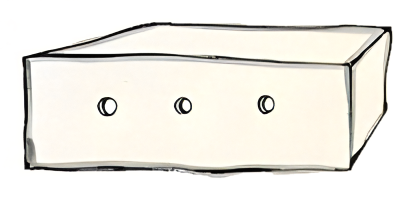

**Módulo:** [0 - Introdução](https://projects.raspberrypi.org/pt-BR/pathways/scratch-intro)

**Atividade:** [6 - Fiz um livro pra você](https://projects.raspberrypi.org/pt-BR/projects/i-made-you-a-book)

**Projeto no Scratch:** [O Pequeno Príncipe](https://scratch.mit.edu/projects/1171484203/)

**Imagens usadas no projeto**: [clique para baixar](./imagens/completo.zip)

**Projeto base, com atores personalizados inclusos**: [entre e faça uma cópia clicando em "Remix"](https://scratch.mit.edu/projects/1175229420/)





---



## Introdução

Chegamos na última atividade da trilha de `design`! Agora, vamos criar um projeto com nossas próprias imagens.

Como em todas as atividades, você está livre pra escolher qualquer tema e imagem que quiser usar!

No exemplo do vídeo, vamos começar uma história do livro "O Pequeno Príncipe".

Esse livro agora é patrimônio da humanidade, já que se tornou domínio público em 2015. Por isso, vamos homenageá-lo nessa atividade.

As imagens escaneadas você pode encontrar [nesse link,](http://users.uoa.gr/~nektar/arts/tributes/antoine_de_saint-exupery_le_petit_prince/the_little_prince.htm) que faz um tributo e preservação da obra.

Além disso, caso você decida seguir o mesmo exemplo do vídeo, você pode baixar as imagens que usamos pra criar o jogo [clicando aqui,](./imagens/completo.zip) ou baixá-las individualmente na seção "Imagens para baixar" abaixo.

Até agora, contemplamos até o capítulo 3 do livro. Conforme aprendermos novos conceitos no Scratch, vamos incrementar esse projeto até completarmos tudo!



Nosso desafio é criar um livro de histórias! Nosso jogo deve conter vários cenários, que serão capítulos de uma história.

Vamos criar um livro com três ou mais cenários, que conterão alguns atores com o intuito de contar uma história, que pode conter textos, sons, imagens e o que mais você quiser.

Devemos usar os conceitos que aprendemos sobre aparência e interação com o mouse!

Como o projeto é um livro, devemos ter uma forma de passar de um capítulo pro outro, como setas nos cantos da tela, por exemplo.

Por último, divirta-se ao fazer o desafio, e não tenha medo de recomeçar caso não esteja satisfeito.



## Correção, dúvidas e bugs

Caso você queira ajuda ou uma correção da atividade, compartilhe o projeto e mande o link pra `atividades@ensineumacrianca.com.br` junto com sua dúvida.
