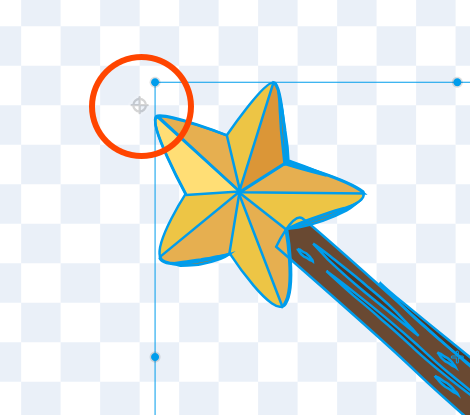

**Módulo:** [1 - Mais Scratch](https://projects.raspberrypi.org/pt-BR/pathways/more-scratch)

**Atividade:** [1 - Transmitindo Feitiços](https://projects.raspberrypi.org/pt-BR/projects/broadcasting-spells/)

**Projeto pronto:** [contém spoilers](https://scratch.mit.edu/projects/1174054243/)

---



Parabéns! Você alcançou a segunda trilha de atividades! Ela vai ser mais desafiadora, mas vamos conhecer muitos conceitos úteis de eventos e lógica de programação.

Nessa atividade aqui, vamos aprender o que são eventos (ou, mensagens) e como podemos usar isso no Scratch pra fazer coisas mais complexas.

Primeiro, já sabe! Abra o link do material no topo da página e siga começando da parte "Você vai fazer"


Aqui não tem segredo: jogue o jogo que o material mostra e veja como ele vai funcionar. Aproveita esse tempo pra pensar como vai ser o seu projeto.

Além disso, ouça o audio disponibilizado sobre a canção `P3T3 P3T3`, tradicional de Gana.



Perceba que nessa parte, o material te sugere iniciar seu projeto começando pelo projeto-base. Caso você não tenha visto o link, [abra aqui](https://scratch.mit.edu/projects/1043072781/editor) e clique em "Remix".

Caso você queira criar o jogo completo, do zero, siga os passos no vídeo desse material no topo da página.

Nessa seção do material, você vai ver instruções de como adicionar o ator da varinha e fazê-la seguir o mouse. O detalhe que quero salientar, é: a ponta da fantasia deve ficar bem próximo, mas não encostar no centro do ator, assim:




Nessa parte, você vai aprender o conceito de mensagens, [clique aqui pra ver uma explicação completa sobre isso.](/conceitos/mensagens)

Não se esqueça de nomear suas mensagens de um jeito que você consiga lembrar! Tente ser o mais objetivo e literal possivel.



A mesma coisa deve ser feita pro botão de crescer. Presta atenção em como fazemos pra inverter o som do ator.

No vídeo que fizemos pra essa atividade, fizemos um pouco diferente, e o som na verdade pertence ao botão, e é tocado quando transmitimos a mensagem.



O processo continua o mesmo, só que agora, trocando a fantasia dos atores.

Essa é sua chance de exercitar a sua criatividade: em qual animal a fada pode se transformar? Procure um som que combina com esse animal.

Não se esqueça de fazer também o script de desfazer a transformação.



Por último, pense em um par pra sua cobaia dos feitiços e adicione um novo ator com o que aprendeu até agora.


Quando terminar as etapas acima, sugiro fazer a seção de "Perguntas Rápidas" pra testar seu conhecimento e também pensar em mais alguma funcionalidade original de sua cabeça pra incrementar seu projeto.

Vejo você na próxima atividade! Não se esqueça de conferir o vídeo pra ver a construção do projeto do começo ao fim.
